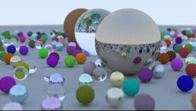

# Ray Tracing

<p align="center">
  
</p>


HIT硕士研究生 计算机图形学作业项目。项目参考 *Ray Tracing in One Weekend*，用 C++ 从基础的射线和球体求交开始，逐步实现相机、材质、随机采样和路径追踪，并输出 PPM 图片。在同一场景和相机轨迹上尝试了几种加速方式，比较不同渲染后端的运行时间。

## 渲染后端

- **CPU**：C++ 多线程参考实现，[线程池](https://github.com/miceVenus/thread_pool)。
- **Embree**：使用 Embree 加速 CPU 射线求交，并沿用项目中的采样和材质逻辑。
- **CUDA**：手写 CUDA 路径追踪 kernel，并使用 BVH 加速球体求交。
- **OptiX**：使用 NVIDIA OptiX 的加速结构和设备端程序进行光线追踪。

## 编译和运行

默认编译 CPU 后端：

```sh
cmake -S . -B build -DCMAKE_BUILD_TYPE=Release
cmake --build build --parallel
./build/raytracer_bench --help
```

也可以用脚本编译并运行指定后端：

```sh
./test.sh cpu
./test.sh embree   # 也接受 emtree
./test.sh cuda
./test.sh optix
```

`test.sh` 使用统一的基准参数：400 像素宽、16:9 画幅、相机绕场景一周、10 秒、30 FPS（共 300 帧）、每像素 100 个采样、最大路径深度 50、固定随机种子。每次运行先预热 1 次，再测量 3 次，并在 `test/frames-<后端>-<时间戳>/` 下保存最后一次测量的 PPM 帧和 `timing.csv`。CPU 和 Embree 使用检测到的逻辑 CPU 数量的三分之二作为工作线程数；渲染计时不包含 PPM 编码和写盘。

CPU 后端可直接构建。Embree 需要在系统或当前环境中安装 Embree 3/4 的开发库。CUDA 和 OptiX 后端通过 `raytrace` micromamba 环境使用 CMake、`nvcc` 和 CUDA 开发库；OptiX 还需要 NVIDIA OptiX SDK，并设置 `OPTIX_ROOT_DIR` 指向 SDK 目录。CUDA 默认面向 RTX 3090 的 `sm_86`，可通过 `RT_CUDA_ARCHITECTURES` 调整。

## 将帧合成为视频

在对应的帧目录中运行以下命令。`pad` 会在尺寸为奇数时补齐一行或一列，满足 H.264 的尺寸要求：

```sh
ffmpeg -framerate 30 -i 'frame_%06d.ppm' \
  -vf 'pad=ceil(iw/2)*2:ceil(ih/2)*2' \
  -c:v libx264 -pix_fmt yuv420p output.mp4
```

## 目录结构

- `component/`：命令行入口，以及相机、射线、几何体、材质和随机数等共享代码。
- `core/`：后端共享的场景和渲染数据结构。
- `bench/`：参考场景生成和 benchmark 计时逻辑。
- `render/normal_cpu/`：CPU 后端。
- `render/embree/`：Embree 后端。
- `render/cuda/`：手写 CUDA 后端。
- `render/optix/`：OptiX 后端及设备端程序。
